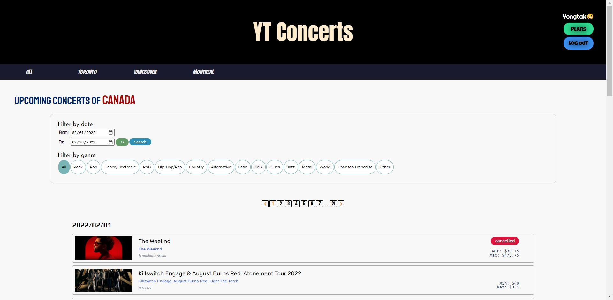
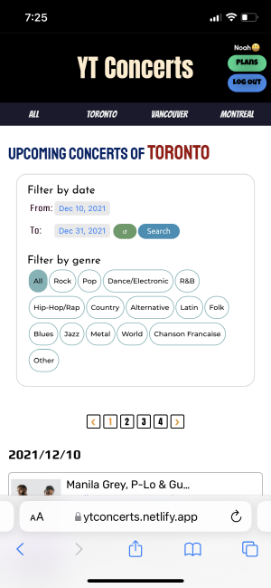

# YT Concerts

YT concerts provides concert information in Canada using 'Ticketmaster' API.

There are many sites that provide concert information in Canada, but it was difficult to find a site that provides price information of several performances at once. (The price information of the concert could only be checked by going to the page showing the detailed information of the concert.) YT concerts compensated for that problem.

### Live Demo

https://ytconcerts.netlify.app/

- It may take longer to load the first page since its server runs on the Heroku free tier.
- It looks different on desktop and mobile. (Responsive design)

### Screenshots

- Desktop ver.

  

- Mobile ver.

  

### Key Features

- Concert information can be filtered by date, and genre.
- Custom pagination is used for providing concert information.
- When you click on the name of the concert, artist, or venue, it moves to the detail page of the concert, artist, and venue, respectively.
- If you use the login function after registering as a member, you can save the concerts you are interested in in 'Plans'.
- It uses Firebase for login function and MongoDB to save concerts in 'Plans'.

### Tech stack

**Frontend**

- React
- Pure CSS (Flex)

**Backend**

- Nodejs (Express)
- Firebase
- MongoDB
- Libraries: mongoose, dotenv, cors

### Links

Click [YT Concerts](https://github.com/yongtakjeon/YTConcerts)
